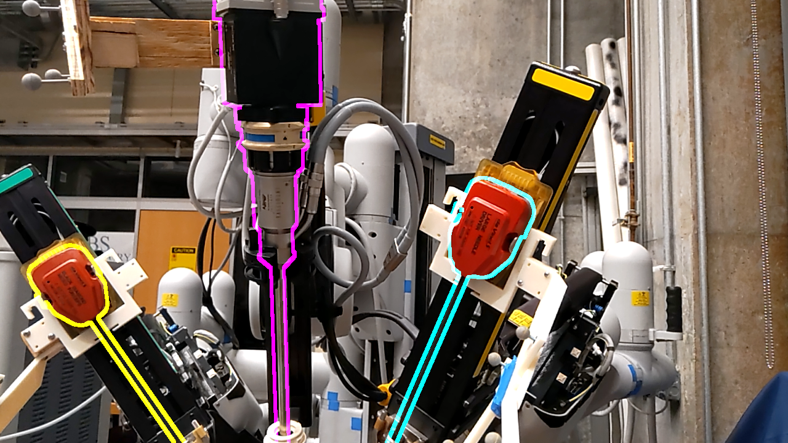
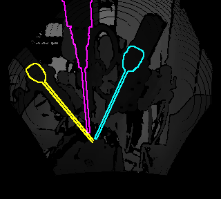

# dVPose






A sample of the dataset is currently available for download
[here](https://livejohnshopkins-my.sharepoint.com/:f:/g/personal/ngreen29_jh_edu/EqHw6Tmr4i1JhgNVFGwaJWkBQ513636EmeaKoPBhBmLp4w?e=1seJnl).
Additional data coming very soon!

Note: the directory structure and organization of the data will change for the official release.


# Cad Models
In the cad models folder, various formats are available for the da Vinci
endoscope (instrument models will be added soon). Also, the optical tracking
marker registrations are provided as 4x4 matrices.


# Raw Data Format
The raw data from the Atracsys_Hololens_streamer tool is structured as follows:

```
root
|
└───run1
│   │   Hololens_00000.json
│   │   Left_PSM_00000.json
|   |   Right_PSM_00000.json
|   |   Endoscope_00000.json
│   │   SPHERES_POSE_00000.json
│   │   AHAT_AB_00000.png
│   │   AHAT_DEPTH_00000.png
│   │   AHAT_00000.json
│   │   VIDEO_00000.png
│   │   VIDEO_00000.json
│   │   VLC_LF_00000.png
│   │   VLC_LF_00000.json
│   │   VLC_RF_00000.png
│   │   VLC_RF_00000.json
|   |   ...
│   
└───run2
│   │   Hololens_00000.json
│   │   Left_PSM_00000.json
|   |   Right_PSM_00000.json
|   |   Endoscope_00000.json
|   │   AHAT_AB_00000.png
|   │   AHAT_DEPTH_00000.png
|   │   AHAT_00000.json
|   │   VIDEO_00000.png
|   │   VIDEO_00000.json
|   │   VLC_LF_00000.png
|   │   VLC_LF_00000.json
|   │   VLC_RF_00000.png
|   │   VLC_RF_00000.json
|   |   ...   
```


The file prefixes correspond to the following things:


`Hololens.json`: Contains the measured pose of the Atracsys marker attached to the
HoloLens, along with a timestamp.

`Right_PSM.json`: Contains the measured pose of the Atracsys marker attached to the
PSM 1 (Right PSM), along with a timestamp.

`Left_PSM.json`: Contains the measured pose of the Atracsys marker attached to the
PSM 2 (Left PSM), along with a timestamp.

`Endoscope.json`: Contains the measured pose of the Atracsys marker attached to the
Endoscope, along with a timestamp.

`AHAT_AB.png`: Contains the Depth Camera's reflectivity image

`AHAT_DEPTH.png`: Contains the Depth Camera's depth image

`AHAT.json`: Contains the 4x4 transformation matrix which describes the pose of
the HoloLens2 Depth camera relative to the HoloLens2 world origin (This matrix is returned by
the HoloLens2 during the image capture. It is not calculated), along with image metadata.

`VIDEO.png`: Contains the RGB Grayscale camera image

`VIDEO.json`: Contains the 4x4 transformation matrix which describes the pose of
the HoloLens2 RGB camera relative to the HoloLens2 world origin (This matrix is returned by
the HoloLens2 during the image capture. It is not calculated), along with image metadata.

`VLC_LF.png`: Contains the Right-Front Grayscale camera image

`VLC_LF.json`:Contains the 4x4 transformation matrix which describes the pose of
the HoloLens2 Left-Front Grayscale camera relative to the HoloLens2 world origin (as returned by
the HoloLens2), along with image metadata.

`VLC_RF.png`: Contains the Right-Front Grayscale camera image

`VLC_RF.json`: Contains the 4x4 transformation matrix which describes the pose of
the HoloLens2 Right-Front Grayscale camera relative to the HoloLens2 world origin (as returned by
the HoloLens2), along with image metadata.


## Important Note
Each Hololens camera image's `.png` file and corresponding `.json` file together
are returned as a single data frame (They are synchronized).
